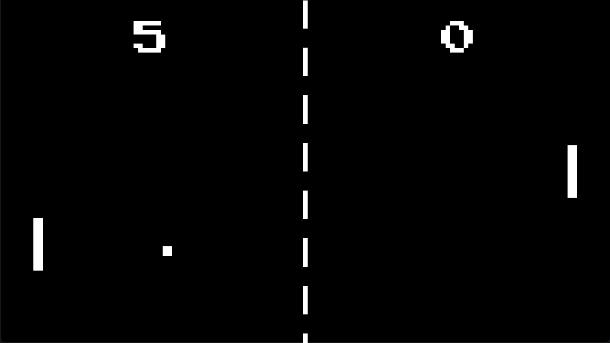

# Pong

Pong is a classic arcade game developed by Atari and originally released back in 1972.
This is a remake of the game, using Go programming language and [Ebitenengine](https://ebitengine.org/).
The gameplay mechanics here are slightly different from the original.



## How to Play

The goal of Pong is to score points by hitting the ball past your opponent's paddle.
You control the right paddle using the arrow keys (up and down).
The game ends when one player reaches 10 points.

## Play Online

You can play the game online via your web browser at drpaneas.net/pong

## Features

- Single player only.
- Three levels of progressive difficulty.
- Sound effects and background music.

## How to Build and Run

To build and run Pong, you will need Go 1.20 installed on your system.
Once you have Go installed, follow these steps:

1. Clone the repository: `git clone https://github.com/your-username/pong.git`
2. Change into the repository directory: `cd pong`
3. Run the game: `go build && ./pong`

## How to Build for the Browser

1. Copy `wasm_exec.js` into the game's wasm dir: `cp "$(go env GOROOT)/misc/wasm/wasm_exec.js" ./wasm/`
2. Build the Web Assembly version of the game into the wasm dir: `env GOOS=js GOARCH=wasm go build -o ./wasm/game.wasm`
3. Create an HTML file (e.g. `./wasm/main.html`) that loads the Web Assembly version of the game and the `wasm_exec.js` file

```html
<!DOCTYPE html>
<script src="wasm_exec.js"></script>
<script>
    // Polyfill
    if (!WebAssembly.instantiateStreaming) {
        WebAssembly.instantiateStreaming = async (resp, importObject) => {
            const source = await (await resp).arrayBuffer();
            return await WebAssembly.instantiate(source, importObject);
        };
    }

    const go = new Go();
    WebAssembly.instantiateStreaming(fetch("game.wasm"), go.importObject).then(result => {
        go.run(result.instance);
    });
</script>
```

4. Create an `index.html` file placed at the root of the repository that loads the HTML file you created in the previous step

```html
<!DOCTYPE html>
<iframe src="./wasm/main.html" width="1280" height="720"></iframe>
```

5. Start a server (e.g. `python -m http.server`) and visit `http://localhost:8000` in your web browser to play your game.
